# معماری سامانه میلینگ سازمانی

## ۱. استک فنی نهایی

| لایه | فناوری |
|---|---|
| فرانت‌اند + بک‌اند | Next.js 14 (App Router) + TypeScript |
| پایگاه داده | PostgreSQL 15+ |
| ORM | Prisma |
| احراز هویت | NextAuth (Credentials + JWT Session) |
| استایل | Tailwind CSS + فونت Vazirmatn (فارسی) |
| تولید PDF | pdf-lib / puppeteer (رندر HTML قالب نامه → PDF) |
| صف/کار پس‌زمینه | BullMQ + Redis (ارسال پیامک، تولید PDF حجیم) |
| ذخیره فایل | فضای فایل محلی در MVP (قابل ارتقا به S3/MinIO) |
| استقرار | Docker + docker-compose (app, postgres, redis) |

انتخاب Next.js تک‌پروژه‌ای (Monolith فول‌استک) باعث می‌شود API Routes و صفحات در یک کدبیس باشند؛ در آینده اگر لازم شد، لایه API به‌سادگی از UI جدا می‌شود چون از همان ابتدا در `app/api/*` طبق قرارداد REST نوشته می‌شود.

## ۲. ساختار پوشه‌ها

```
mailing-system/
├── prisma/
│   ├── schema.prisma
│   ├── seed.ts
│   └── migrations/
├── src/
│   ├── app/
│   │   ├── (auth)/login/
│   │   ├── (dashboard)/
│   │   │   ├── dashboard/
│   │   │   ├── contacts/
│   │   │   ├── tags-groups/
│   │   │   ├── letterheads/
│   │   │   ├── letters/
│   │   │   ├── campaigns/
│   │   │   ├── sms-settings/
│   │   │   ├── reports/
│   │   │   └── settings/organizations|users|roles/
│   │   ├── l/[shortCode]/           ← صفحه عمومی مشاهده نامه (لینک کوتاه)
│   │   └── api/
│   │       ├── auth/[...nextauth]/
│   │       ├── contacts/
│   │       ├── tags/  groups/
│   │       ├── letterheads/  letters/
│   │       ├── campaigns/  campaigns/[id]/recipients/
│   │       ├── documents/generate/
│   │       ├── short-links/[code]/
│   │       ├── sms/send/  sms/webhook/
│   │       └── reports/
│   ├── components/          ← کامپوننت‌های قابل استفاده مجدد (RTL)
│   ├── lib/
│   │   ├── auth.ts  db.ts  permissions.ts
│   │   ├── pdf/generateLetterPdf.ts
│   │   ├── sms/provider.ts (اینترفیس انتزاعی درگاه پیامک)
│   │   └── shortlink/generateCode.ts
│   ├── server/services/     ← منطق دامنه (contactService, campaignService, ...)
│   └── styles/
├── public/
├── docker-compose.yml
├── Dockerfile
└── .env.example
```

## ۳. مدل چندسازمانی (Multi-tenant)

- استراتژی: **Shared Database, Shared Schema** با ستون `organizationId` روی تمام جداول دامنه‌ای (ساده‌ترین برای MVP، قابل ارتقا به schema-per-tenant در آینده).
- هر Query سرویس‌ها از یک لایه میانی (`withOrgScope`) عبور می‌کند که به‌صورت خودکار فیلتر `organizationId` و در صورت نیاز `departmentId` را اعمال می‌کند تا نشت داده بین سازمان‌ها ممکن نباشد.
- نقش کاربر در JWT session ذخیره می‌شود: `role`, `organizationId`, `departmentId`.

## ۴. کنترل دسترسی (RBAC)

پنج نقش پایه (بخش ۲ سند نیازمندی) + جدول `permissions` قابل تنظیم برای override دقیق‌تر در آینده. در MVP، ماتریس نقش↔اکشن به‌صورت ثابت در `lib/permissions.ts` تعریف و توسط middleware هر API Route چک می‌شود؛ جدول `permissions` در دیتابیس از ابتدا وجود دارد تا مسیر ارتقا به دسترسی پویا بسته نشود.

## ۵. جریان اصلی کمپین (End-to-End)

```mermaid
flowchart LR
A[ایجاد کمپین: نام/سربرگ/قالب] --> B[انتخاب مخاطبین: فرد/گروه/برچسب/ترکیبی]
B --> C[لیست نهایی قابل ویرایش]
C --> D[تعیین متن نامه + متغیرها + override فردی]
D --> E[پیش‌نمایش نامه هر مخاطب]
E --> F[تنظیم متن پیامک + انتخاب درگاه]
F --> G[تأیید نهایی]
G --> H[صف تولید PDF برای هر مخاطب]
H --> I[ایجاد short_link برای هر PDF]
I --> J[صف ارسال پیامک با لینک]
J --> K[ثبت وضعیت در campaign_recipients + audit_logs]
```



تولید PDF و ارسال پیامک در صف پس‌زمینه (BullMQ) انجام می‌شود تا کمپین‌های با هزاران مخاطب، رابط کاربری را مسدود نکنند و امکان تلاش مجدد (retry) روی موارد ناموفق وجود داشته باشد.

## ۶. امنیت لینک کوتاه

- کد لینک: ۱۰ کاراکتر تصادفی از الفبای امن (base62، بدون کاراکترهای مشابه) — تولید با `crypto.randomBytes`.
- بدون شناسه ترتیبی؛ جدول `short_links` ایندکس یکتا روی `code` دارد.
- هر لینک به یک `generated_document` واحد اشاره می‌کند؛ صفحه عمومی `/l/[code]` فقط PDF مرتبط را نشان می‌دهد، نه لیست فایل‌ها.
- پشتیبانی از `expiresAt`، `isActive`، `accessCode` اختیاری (برای اسناد حساس)، و ثبت `lastViewedAt` + شمارنده بازدید.

## ۷. تولید PDF

- قالب نامه به‌صورت HTML/CSS (با متغیرهای Handlebars-like `{{نام مخاطب}}`) ذخیره می‌شود.
- سرویس `generateLetterPdf` قالب + سربرگ + داده مخاطب را ترکیب و توسط headless Chromium (puppeteer) به PDF رندر می‌کند.
- کلید یکتایی تولید: هش از (`campaignId`, `contactId`, `letterTemplateVersion`) تا اجرای مجدد یک عملیات، فایل تکراری نسازد؛ در صورت تغییر نامه، نسخه جدید با شماره نسخه ثبت می‌شود.

## ۸. مراحل بعدی

پس از تأیید این معماری و مدل داده (سند ۰۲)، ساخت کد واقعی به همین ترتیب انجام می‌شود:
`Auth/Org → Contacts → Tags/Groups → Letterheads/Letters → Campaigns/PDF → Short Links → SMS → Dashboard`

---

## ۹. تفاوت‌های پیاده‌سازی MVP با استک اولیه

این سند پیش از کدنویسی نوشته شده بود. در پیاده‌سازی، سه انتخاب ساده‌تر شد.
دلیل و مسیر ارتقای هرکدام اینجا ثبت است تا تصمیم‌ها بعداً قابل بازبینی باشند.

| مورد | سند اولیه | پیاده‌سازی MVP | چرا | مسیر ارتقا |
|---|---|---|---|---|
| احراز هویت | NextAuth (Credentials + JWT) | کوکی HttpOnly امضاشده با HMAC-SHA256 + bcrypt | حدود ۶۰ خط به‌جای یک لایه adapter و provider که فقط یک روش ورود دارد | وقتی SSO/OIDC لازم شد، NextAuth یا OIDC اضافه شود |
| تولید PDF | puppeteer / pdf-lib | صفحه HTML با استایل چاپ A4 و «چاپ / ذخیره PDF» مرورگر | رندر فارسی و RTL در مرورگر بی‌نقص است؛ puppeteer + فونت فارسی حدود ۳۰۰ مگابایت به ایمیج اضافه می‌کرد | برای بایگانی خودکار سمت سرور، همین صفحه با headless Chromium چاپ شود |
| صف کار | BullMQ + Redis | حلقه ترتیبی داخل همان درخواست | برای چند صد مخاطب کافی است و یک سرویس کمتر برای نگهداری | کمپین چندهزارنفره: `sendCampaign` و `generateDocuments` را داخل worker صف صدا بزنید — امضای هر دو برای همین آماده است |

موارد دیگر طبق همین سند پیاده شدند: Next.js 15 (App Router) + TypeScript، PostgreSQL + Prisma،
Tailwind + Vazirmatn، multi-tenant با `organizationId` روی جداول دامنه‌ای، و RBAC با ماتریس نقش↔مجوز.

### افزوده‌های پیاده‌سازی نسبت به سند

- **دفترچه عمومی/خصوصی** (`Contact.visibility` + `ownerUserId`) با فیلتر مرکزی در `src/lib/scope.ts`.
- **نامه محرمانه** (`Campaign.confidentiality`): کد دسترسی شش‌رقمی روی لینک کوتاه، ارسال در پیامک دوم.
- **PWA**: manifest + service worker کمینه؛ نصب روی اندروید/کروم و Add to Home Screen در iOS.
- **پاک‌سازی HTML**: متن نامه را کاربر می‌نویسد و در صفحه عمومی رندر می‌شود، پس با سفیدلیست تگ و صفت
  پاک‌سازی می‌گردد (`sanitizeHtml` در `src/lib/render.ts`، با تست در `src/lib/selftest.ts`).
